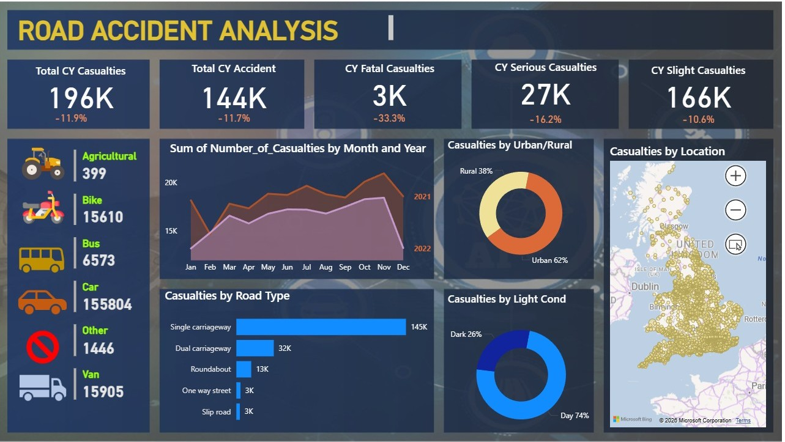

# 🚗 Road Accident Analysis Dashboard

## 📌 Project Overview

This project presents an interactive Power BI dashboard built to analyze road accident data.
The goal is to identify key trends, patterns, and factors contributing to accidents, helping in better decision-making and road safety improvements.

---

## 📊 Dataset Details

The dataset includes:

* Total number of accidents and casualties
* Accident severity levels (Fatal, Serious, Slight)
* Vehicle types involved
* Road type and location
* Time-based data (year/month trends)

---

## 🛠️ Tools & Technologies

* Power BI (Data Visualization)
* Power Query (Data Cleaning & Transformation)

---

## 📷 Dashboard Preview

---

## 📈 Key Insights

* A large proportion of accidents fall under the **slight severity category**
* **Cars** are the most frequently involved vehicle type
* Accidents show a **clear trend over time**, indicating seasonal patterns
* Urban areas tend to have a **higher concentration of accidents**
* Certain road types are more prone to accidents

---

## 📥 Download Dashboard File

[Download PBIX](./RoadAccidentAnalysis.pbix)

---

## 🚀 How to Use

1. Download the `.pbix` file
2. Open it in Power BI Desktop
3. Use filters and visuals to explore the data interactively

---

## 📚 Learning Outcomes

* Built a complete end-to-end Power BI dashboard
* Gained experience in data cleaning and transformation
* Learned how to create interactive and insightful visualizations
* Improved data storytelling skills

---

## 🔮 Future Improvements

* Add real-time data integration
* Include predictive analysis (Machine Learning)
* Enhance dashboard interactivity

---

## 👤 Author

**Astha Pal**
